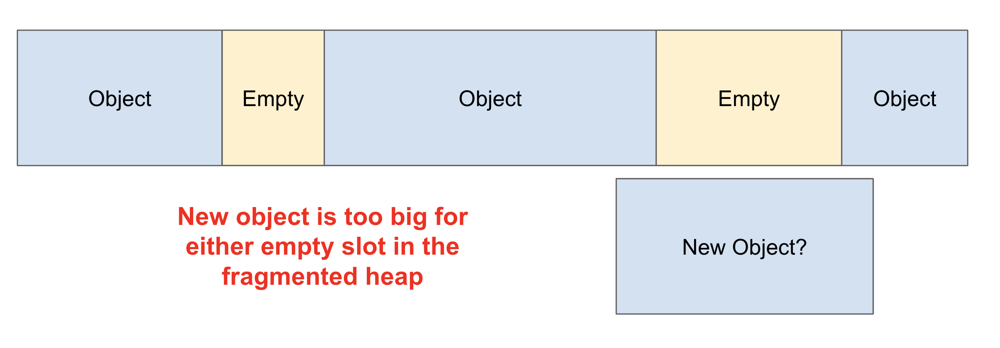
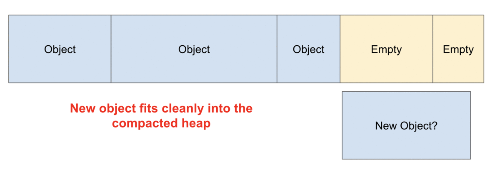

# Bit Mesh Allocator


<div style="
<div class="flex-container" style="display: flex;
    gap: 20px;">
    
    
</div>


 


An efficient allocator optimized for large objects, offering O(1) amortized allocation and O(1) deallocation, with no fragmentation issues.

## About project

This is my first project in C as a beginner. There are many concepts and materials that I still don’t fully understand, but I am doing my best. I am studying computer science for about 8 to 9 months, In the meanwhile i have realized that system programming is incredibly exciting, which motivated me to focus my efforts on it. For my first tool, I chose C because it is special; it provides a great deal of control over hardware.
A few days ago, I started learning C. Prior to this, I was working on a compiler for my programming language in Lisp. I found that memory management in C is more challenging than I initially thought. After further study, I learned about a concept called "fragmentation." When using malloc and free repeatedly, fragmentation can occur, leading to inefficiencies.
To address this issue, I decided to create a memory management system similar to malloc and free that minimizes memory fragmentation. This system can effectively handle large objects since the metadata for each object on a 64bit System is approximately 40 bytes. However, for embedded systems, this approach may not be efficient enough since most embedded systems have very limited memory, often under 1 MB, a metadata size of 40 bytes per object is inefficient, or it's not? You know better than me :) , so I plan to develop another project specifically tailored for those systems soon. For now, my solution can be used on general-purpose computers without any problems. 
 
## Usage 

To start , include the bmalloc.h header file at the top of your program

```C
#include "bmalloc.h"
```

Then, initialize a memory heap with initial_memory_heap(size), where size is the amount of memory to reserve for allocations. For example:

```C
initial_memory_heap(1024);  // Initializes a heap of 1024 bytes
```

To allocate memory for a variable, first declare (or define, since some declarations also consume memory) a variable of the desired type. For example: 

```C
char* my_string;
```

- To allocate memory 

```C
allocate_memory((void**)&my_string, sizeof(char) * 5);
```

This allocates 5 bytes for my_string, enough to store a 4-character string + null , similar to using malloc.

- To deallocate memory for a specific variable

```C
deallocate_memory((void**)&my_string);
```

- To deallocate all allocated objects while preserving all structures, eliminating the need to call the initial_memory_heap function afterward

```C
deallocate_all();
```

- To simultaneously deallocate all memory allocations, including the initialized heap memory, use a single function call that effectively clears all allocated resources.

```C
destroy();
```

## Compilation and Run

I created a Makefile that can be customized for your own configurations. The default path for the output file is set to /bin, and your source code is located in src/main.c.

To compile the project, first navigate to the root directory and use the make command. :

```bash
cd BitMeshAllocator && make clean && make
```
To run the executable, navigate to the bin directory and execute:

```bash
cd bin && ./the_program
```

## Contributing
Pull requests are welcome. For major changes, please open an issue first
to discuss what you would like to change.

Please make sure to update tests as appropriate.

## License


